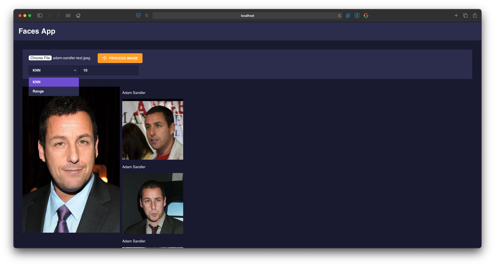

# Base de Datos 2 - Proyecto 3
### Integrantes
- Anthony Guimarey Saavedra
- Massimo Imparato Conetta
- Sebastian Knell Noriega

## Índice
  - [Introducción](#introducción)
  - [Implementación](#implementación)
    - [Construcción del índice Rtree](#construcción-del-índice-rtree)
    - [Algoritmo de búsqueda KNN](#algoritmo-de-búsqueda-knn)
    - [Algoritmo de búsqueda por Rango](#algoritmo-de-búsqueda-por-rango)
    - [Análisis y experimentación](#análisis-y-experimentación)
    - [Aplicación Web](#aplicación-web)
  - [Prueba de uso](#prueba-de-uso)


## Introducción
El objetivo de este proyecto fue implementar un servicio web para la identificación automática de personas a partir de una colección grande de imágenes de rostros. 
Está enfocado en la construcción optima de una estructura multidimensional para dar soporte a las búsquedas y recuperación eficiente de imágenes. Para ello hacemos uso de la libreria [Face Recognition](https://github.com/ageitgey/face_recognition). En dicha librería ya se encuentra implementado las técnicas necesarias para obtener de cada imagen una representación numérica y compacta (enconding). Se usará una colección de referencia con más de 13 mil imágenes de rostros de personas, disponible en el [siguiente enlace](http://vis-www.cs.umass.edu/lfw/).


## Implementación
### Construcción del índice Rtree
Para construir el índice Rtree, se usó la librería [Rtree](https://pypi.org/project/Rtree/) de python, que provee los métodos necesarios para que indexemos nuestros vectores característicos.

### Algoritmo de búsqueda KNN
La búsqueda KNN nos retorna los K elementos más cercanos. En ese sentido, utilizamos este tipo de búsqueda para retornar las imágenes que son las K más similares al objeto de consulta.

#### KNN-Rtree
```python
def KNNRtree(k, query, n):
    rtree = 'RtreeIndexFile' + str(n)
    encodedQuery = encode(query)
    prop = index.Property()
    prop.dimension = 128
    prop.buffering_capacity = 10
    rtreeIndex = index.Rtree(rtree, properties=prop)
    queryList = list(encodedQuery)

    for elem in encodedQuery:
        queryList.append(elem)
    return rtreeIndex.nearest(coordinates=queryList, num_results=k, objects='raw')
```

#### KNN-Secuencial
```python
def KNNSequential(k, query, n):
    encodedQuery = encode(query)
    dirList = os.listdir(path)

    count = 0
    names = []
    known = []
    shouldBreak = False

    for filepath in dirList:

      folderPath = path + '/' + filepath
      imageList = os.listdir(folderPath)


      for imageFile in imageList:
        count += 1
        imagePath = folderPath + '/' + imageFile

        #processing this image
        # print(imageFile)

        image = fr.load_image_file(imagePath)
        encodings = fr.face_encodings(image)
        if encodings:
          names.append(imageFile)
          known.append(encodings[0])
        
        if count == n - 1:
          shouldBreak = True
          break
    
      if shouldBreak:
        break

    distancesList = fr.face_distance(known, encodedQuery)
    result = []

    for i in range(len(distancesList)):
        result.append((distancesList[i], names[i]))

    heapq.heapify(result)
    return heapq.nsmallest(k, result)
```

### Algoritmo de búsqueda por Rango
La busqueda por rango nos retorna 0 o más elementos, pues el resultado depende del radio establecido.

```python
def rangeSearch(k, query):
    '''encodedQuery = encode(query)
    dirList = os.listdir(path)

    count = 0
    names = []
    known = []

    for filename in dirList:
        count += 1

        print("Processing: ", filename)
        imageFile = path + '/' + filename
        image = fr.load_image_file(imageFile)

        encodings = fr.face_encodings(image)[0]

        names.append(filename)
        known.append(encodings)
    
    distances = fr.face_distance(known, encodedQuery)
    result = []

    for i in range(count):
        result.append((distances[i], names[i]))
    
    heapq.heapify(result)
    return heapq.nsmallest(k, result)'''
```

### Análisis y experimentación

Tiempo (s) | KNN-Rtree | KNN-Secuencial
------------ | ------------- | -------------
N=100 | 1.03 | aaa
N=200 | 0.64 | aaa
N=400 | 0.60 | aaa
N=800 | 0.78 | aaa
N=1600 | 1.06 | aaa
N=3200 | 1.53 | aaa
N=6400 | 1.02 | aaa
N=12800 | 0.97 | aaa

Valor de K = 8

### Aplicación web
Para visualizar los resultados implementamos una pequeña aplicación web usando [Flask](https://flask.palletsprojects.com/en/2.0.x/#) para el servidor y [Angular](https://angular.io/) para el front. A continuación se muestra la interfaz.



## Prueba de uso
Se adjunta el siguiente video que muestra la funcionalidad de la aplicación.

[DB2 - Proyecto 3 - Funcionalidad de la aplicación](https://drive.google.com/file/d/1SS0O3PAcSOQGlNwARbTqmmsrfI3t6tn4/view?usp=sharing)
